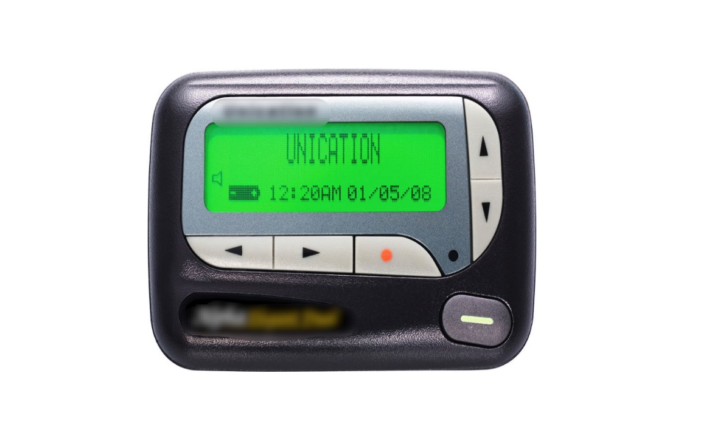
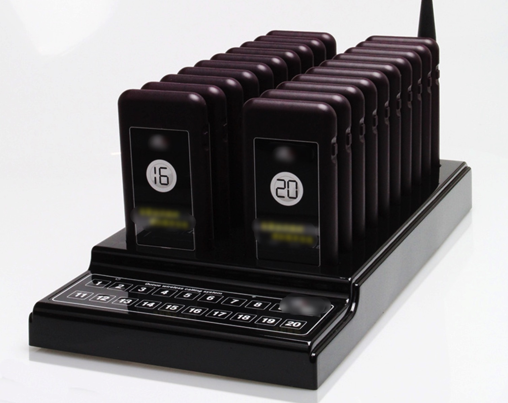
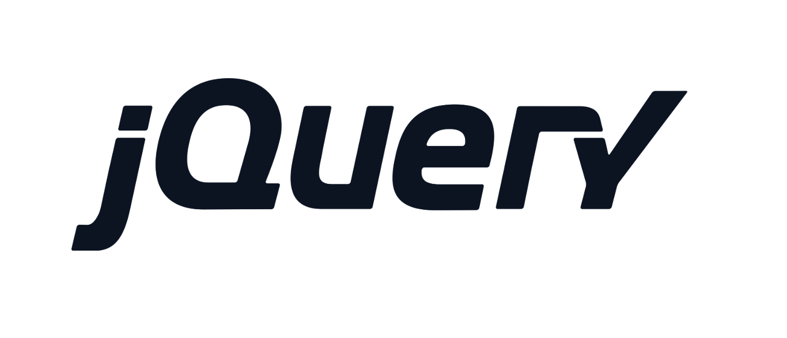
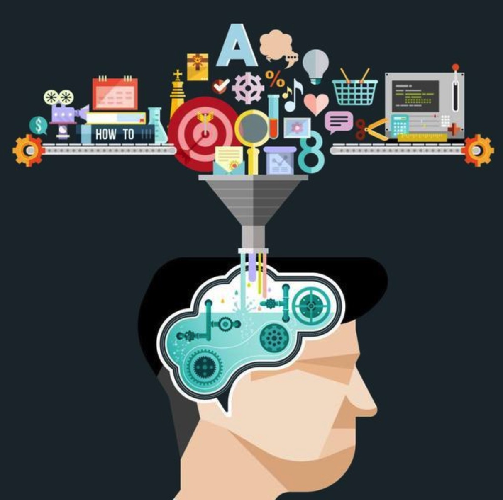

# 从寻呼机到jQuery，一枚jQuery钉子户的独白

## 前言

今年难得的4天五一假期，放假当天就去下馆子吃饭，发现餐馆的叫餐系统很奇特，在前台点餐后，每桌领取块塑料牌子。餐馆前台在饭菜做好的时候，就做操作让食客的塑料牌子响动和发亮，引导食客交回塑料牌子然后去取餐。

当时点餐的我觉得这套系统很高大上，最后回家上网一查，发现这种系统叫“无线取号寻呼系统”，换句通俗的话来讲，就是局域网的“寻呼机”或者“BB机”。这就涨知识了，我的惯性常识认为二十多年前主流通信工具的“BB机”，应该早就退出历史的舞台，尘封在日新月异智能手机的浪潮底下，没想到此类技术还能在餐饮行业的信息化发展中继续发挥着余热。

当我抱着好奇心在网上继续搜索时候，发现当年的“BB机”无线寻呼技术除了应用在餐饮行业，还应用在医院的局域通信中。说到这里，也许读者很奇怪我会这么大的反应，因为我是信息工程专业出身的，虽然毕业后从事了互联网前端开发工作，但是大学4年耳濡墨染的通信技术还是有一定的技术敏感度的。

这次假期吃饭发现的“BB机”技术的新时代应用，在处于互联网前端技术的频繁更替的大环境下，给了我很大的思考，因为我的开发工作时间中，基本每周有那么一两次和同事对所谓前端“新旧技术”的友好(si)交流(bi)。因为我负责的是基础功能的前端应用，接受的锅很多都是近十年的陈年代码，基础应用99%都是基于jQuery的技术去实现的。日常重构和升级，最大的交流是对jQuery是否已经落伍淘汰的讨论和分析。

## 寻呼机的前世今生

作为一个电子信息相关专业出身的开发者，先从卖弄一下自己了解到的“寻呼机”技术历史

> 注: 图片来自于网络

- 大概在1970年代，寻呼机在香港和台湾开始流行，香港称之为“Call机”，也有称之为“传呼机”、“BB机”或者“BP机”。
- 到了1980年代，寻呼机开始在内地普及。在1990年代，内地的寻呼机业务达到了空前的繁荣。
- 到了1990年代，此时的香港由于手提电话的开始普及，寻呼机开始没落了。但是直到2017年，香港仍然有一间无线电寻呼运营商继续运营“寻呼机”的服务。
- 1998年，中国的寻呼机数量达到六千多万，已经是世界第一的数量。
- 2000年后，功能手机开始普及，寻呼机在内地开始式微。
- 直到2007年，内地大部分身份的运营商开始申请停止寻呼机的无线传呼服务，这也标志着“寻呼机”在内地正式推出通信界的历史舞台。
- “寻呼机”虽然在推出了主流民用通信方式，但在一些特殊场合，如餐厅和医院，利用其在局域网内无线寻呼通信能力，继续发光发热实现着自己的技术价值。

> 注: 图片来自于网络

## jQuery真的过时了么？

### 先聊聊jQuery的历史

> 注: 图片来自于网络

上述说了一大通“寻呼机”的前世今生，以及在特定场景仍旧发挥着余热，那我们来说说jQuery的前世今生以及是否已经过时了。以下我们来先聊聊jQuery的主要发展历程。

- 2006年，jQuery发布了第一个正式版本，1.0
- 2009年，jQuery 1.3.2 引用了Sizzle选择器引擎
-	2011年，jQuery 1.5.2 重写了Ajax模块
- 2012年，jQuery 1.8.3 重写Sizzle引擎
- 2013年，jQuery 2.0.3 不再支持 IE 6-8，降低体积大小，提高性能
- 2016年，jQuery 3.0 发布，Ajax支持Promise
- 2018年，jQuery 3.3.1 发布，使用了更多ES和HTML5新特性

从上述的jQuery的发展历程看，jQuery的从诞生开始，发展没有停止过。jQuery在1.x阶段是处理PC端操作的兼容，在2.x阶段是为了摈弃低版本IE的兼容和提高性能，在3.x阶段则是与时俱进，吸收了很多ES和HTML5新特性。

### 再聊聊主流前端框架的实际应用对比

近几年来，前端的框架和工具库层出不穷，大浪淘沙后，目前呼声较高的框架有 React.js、Vue.js和Angular。同时，在2018年GitHub宣布放弃使用jQuery的时候，前端社区对摈弃jQuery的声音层出不穷。因为我工作中可以说50%的开发是跟jQuery有关的，在这种背景下，我就在想jQuery真的有那么落后么？

我换了一种思考角度，我为啥还使用jQuery？是在什么情况下我选择使用了jQuery？

我开发过程中，遇到的场景是服务端是Java，主要提供服务端渲染，前端用jQuery绑定对应的操作事件和DOM变化。
我的业务需求，遇到的是SEO强需求，需要在服务端渲染模板上动态渲染好数据，等待爬虫来抓取数据。
我的维护中。同时还要最低要兼容到IE8，保证在IE8上基本能正常使用。

- 现在我们假设选则了React

那么第一个就面临着IE8的兼容性问题，这个是无解的，即使引用一堆 polyfill 库也不能彻底解决问题。
再次就是服务端模板渲染的问题，如果是以服务端Java的模板为主呢，那么React本身的JSX模板就需要重写一套，前端页面渲染时候，覆盖在服务端渲染的DOM上面。如果是以React模板为主呢，就得需要人力和机器投入去整一套SSR系统专门做服务端渲染。

- 现在我们假设选择Vue或者Angular

其实会发现遇到的困难和 React类似的。

从上述很浅显的应用选择层面就可以知道，其实jQuery还是有一定的应用场景的，React/Vue/Angular虽然流行且提高开发效率但是也有一定的场景短板的。就像刚开始的“BB机”的历史和如今的应用场景一样，总结一句话，没有落后的技术，只有不适应场景的技术。

## 我们使用jQuery要注意什么？

其实如果只是考虑Chrome和IE11+的浏览器，普通的DOM操作和事件直接用原生浏览器WebAPI就可以满足要求，但是如果考虑到兼容性和API统一性，用jQuery其实也是个不错的选择。React/Vue/Angular的方便性就是抹平了操作DOM的方式，让开发者可以更关注于组件的组合和业务的实现，而jQuery核心就是操作DOM，所以很多DOM操作的注意事项要关注的。

jQuery的使用注意点其实就只有一点，就是操作DOM事件和数据生命周期控制，保证DOM在销毁时候，对应有事件和数据也一并清除，避免事件注册太多和数据残留导致的内存溢出。

- 事件的生命周期
  - jQuery给DOM注册了`$('div').on('click')`事件，如果DOM有销毁的步骤，那么在销毁前就要一并把事件给删除掉`$('div').off('click')`
- DOM绑定数据声明周期
  - jQuery给DOM绑定了数据`$('div').data({a:123})`，如果DOM有销毁的步骤，那么在销毁前就要一并把数据给清除掉

## 技术选型的STAR法则

我们从“寻呼机的前世今生”讲到“jQuery的是否过时”，其实核心的一点就是在讨论一个技术是否有过时落伍一说。

一门技术的诞生肯定是有其应用场景，所谓的“过时”，是应该相关的应用场景有更加高效低成本的技术代替了。

一门技术其实就是一种工具，工具的诞生是为了解决实际问题，脱离了实际问题的本身，技术的价值很难说清楚。所以这里面对技术选型，我的建议是参考STAR法则。

- Situation 场景
- Task  任务
- Action 行动
- Result 结果

套用上述的内容我们可以这么说

- S: 餐馆点菜和送菜需要提高效率
- T: 顾客点菜、厨师做好菜、通知顾客菜好了，让顾客取餐，来降低运营成本
- A: 要定制一个系统，来让顾客点菜，厨师做好菜后，通知顾客去领取，所以需要一个局域网的通信低成本系统，对比很多寻呼技术，发现“BB机”的成本最低，就去落地开发。
- R:最后结果是，无线餐馆寻呼系统实现了，顾客不用去找服务员问进度等待被寻呼，服务员也不用频繁被顾客询问，厨师也不用频繁被服务员催。

问题圆满解决

我为啥选择jQuery技术呢
- S: 在现有Java系统上，低成本实现SEO友好的动态数据展示型页面
- T: Java服务端动态数据渲染，前端展示型页面，轻量的事件交互，要低成本。
- A: Java服务端直接根据不同数据动态渲染HTML，前端用jQuery直接操作DOM的事件和效果
- R: 快速让页面上线，无需新增SSR开发量。

## 前端技术的信息熵

> 熵，通常作为一个物理名词，用来描述一个系统的混乱程度，失序程度的指标。在我大学信息工程专业学习的信息导论中，信息熵是接受的每条消息里包含信息的数量和不确定性的综合度量。也就是消息里包含的信息数量、不确定性和随机性越大，就代表着信源的熵就越大。

> 注: 图片来自于网络

近几年互联网的技术发展飞快，各种技术框架爆炸性增长，带来的是眼花缭乱的技术选型困难症。对比原来比较中规中矩的前端技术体系，在2012年前，jQuery + jQuery衍生框架是主流前端技术体系，主要的理念是如何更加兼容地操作DOM和渲染页面。

但是大概2012年以后，各种前端技术理念开始普及，例如MVVM, Virtual-Dom等，对原有有序的前端技术体系带来冲击，极大提高了前端技术体系的信息熵，这带来利的一面是技术选择面广了，弊的一面是需要更多时间去衡量和选择技术。

到现在，一提到前端技术体系，充斥着眼花缭乱的技术框架和衍生框架。信息熵的增大，有序变无序并不可怕，最重要的是，要怎么学会在庞杂的前端信息中学会选择技术，学会应用到实际的场景中。

## 后记

对于技术优劣的讨论，一切脱离了实际问题场景讨论技术优劣的都是耍流氓。没有的绝对的银弹，只有合适场景的解决方案。

