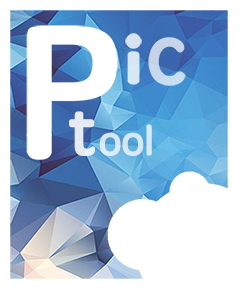
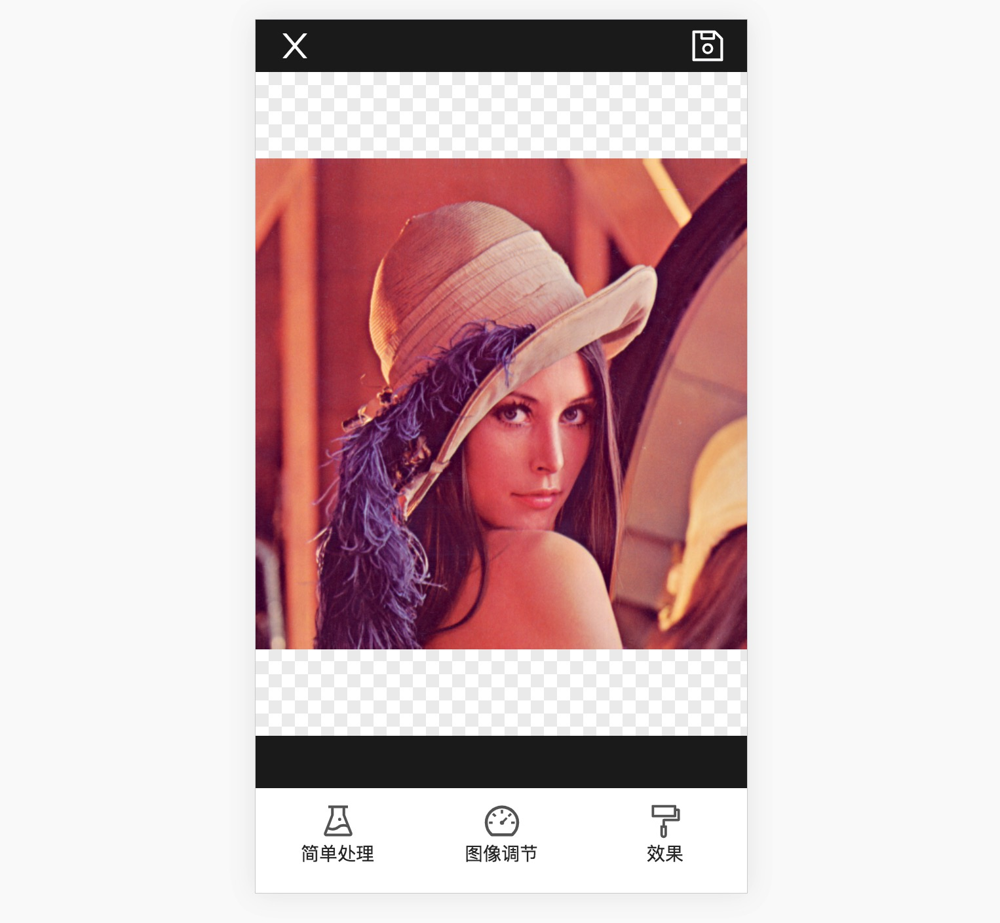
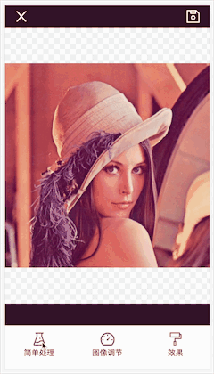
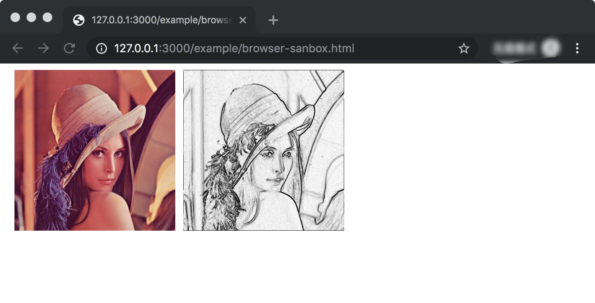
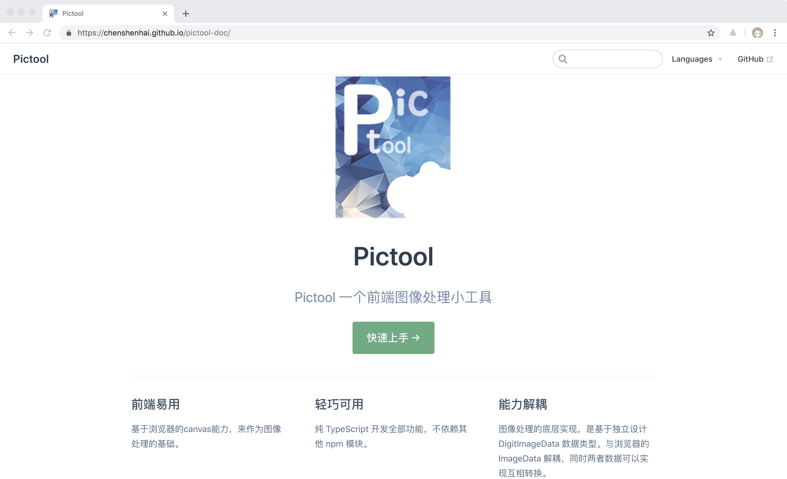
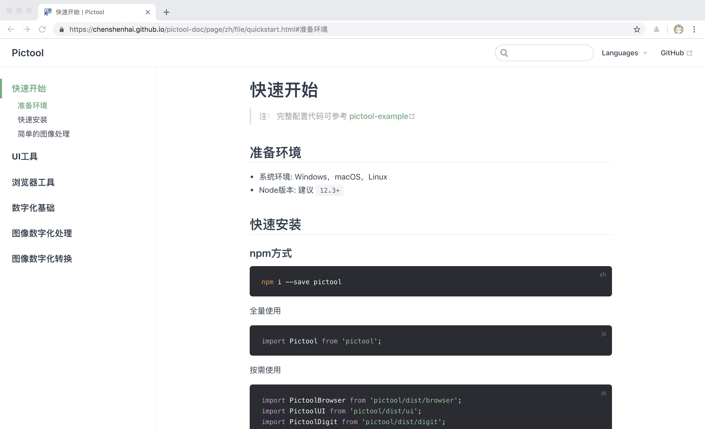
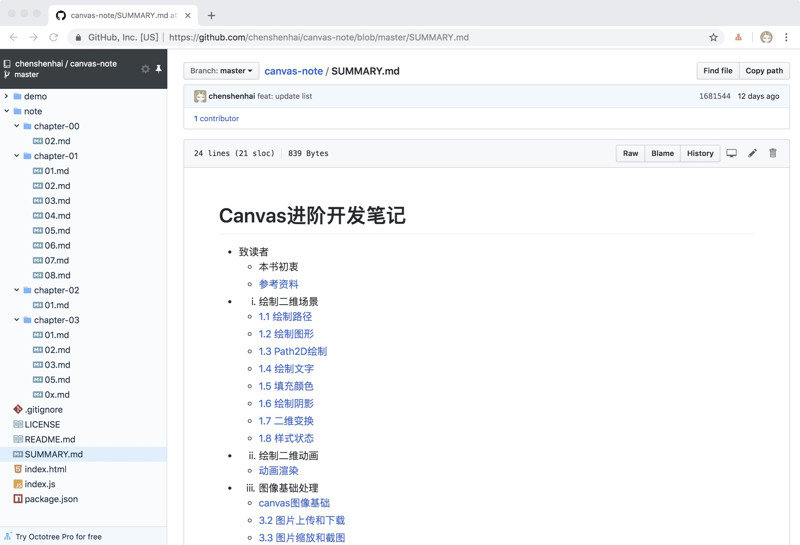

# 用TypeScript写了个低配版H5美图工具 

## 前言

最近两月在学习`canvas`时候，发现很多有意思的技术能力，特别是在图像处理这一领域。让我想起大学课堂教学的《数字图像处理》(冈萨雷斯 版本)。但是很遗憾的是，大学上完课应付考试后全部还给老师了，毕业后一直做WEB相关开发，再也没怎么去接触图像处理这一领域技术。

利用每天下班回家后的零星时间，用`TypeScript`基于`canvas`的能力，写了一个H5图像处理小工具，勉强算是低配版的“美图秀秀”。这个图像处理的小工具我命名为 `Pictool`。


具体源码地址 

[https://github.com/chenshenhai/pictool](https://github.com/chenshenhai/pictool)


具体文档地址

[https://chenshenhai.github.io/pictool-doc/](https://chenshenhai.github.io/pictool-doc/)

在线例子
[https://chenshenhai.github.io/pictool/example/index.html](https://chenshenhai.github.io/pictool/example/index.html)





## CDN 快速使用

```html
<script src="https://unpkg.com/pictool/dist/index.min.js"></script>
```

```js
(function(Pictool) {
  const util = Pictool.browser.util;
  const PictoolUI = Pictool.UI;

  // 获取测试图片，实际使用请输入实际的图片URL
  // 注意如果图片是跨域的，请保证图片源站允许跨域
  util.getImageDataBySrc('./xxx.jpg').then(function(imgData) {
    const pictoolUI = new PictoolUI(imgData, {
      uiConfig: {
        language: 'zh-cn',
      },
    });
    pictoolUI.show();
  }).catch(function(err) {
    alert(JSON.stringify(err));
  });
})(window.Pictool);
```



### 具体动态效果


## NPM使用

快速安装

```sh
npm i --save pictool
```

快速使用

```js

import Pictool from 'pictool';

(async function() {
  const imgData = await Pictool.browser.util.getImageDataBySrc('./xxx.jpg');
  const tool = new Pictool.UI(imgData, {
    uiConfig: {
      language: 'zh-cn',
    },
  });
  tool.show();
})()

```

把编译后的代码放在`HTML页面上`，就可以实现上述`CDN`的使用效果



## Pictool 功能

`Pictool` 图像处理小工具目前支持了常用的图像处理能力，分别都可以独立抽出使用。

### 图像处理能力

- `Brightness(Lightness)` 亮度
- `Hue` 色相
- `Saturation` 饱和度 
- `Alpha` 透明度
- `Invert` 反色
- `Grayscale` 灰度
- `Sobel` Sobel边缘计算
- `Sepia` 褐色化(怀旧)
- `Posterize` 色阶
- `Gamma` 伽马处理

### 图像滤镜效果

可以通过图像处理的基础能力，组合成滤镜效果。
例如 `Sobel边缘计算` + `反色` 组合就可以产生 `素描画` 的效果




```js
var sandbox = new Pictool.browser.Sandbox('./xxx.jpg');
sandbox.queueProcess([
  { process: 'sobel', options: {}, },
  { process: 'invert', options: {}, }
]).then(function(base64) {
  document.querySelector('body').innerHTML = ``;
}).catch(function(err) {
  console.log(err);
});
```

### 浏览器能力

- 图片数据转换
  - 图片 `URL`转图片`HTMLImage`
  - 图片 `URL`转图片`ImageData`
  - 图片 `ImageData`转图片`base64`
- 图片压缩: 将图片压缩在 400百万像素内
- 其他能力，详见文档
  - [https://chenshenhai.github.io/pictool-doc/](https://chenshenhai.github.io/pictool-doc/)


## Pictool 文档

在写了这个 `Pictool` 图像处理小工具后，顺便把所有的功能点的使用方式都整理成文档，方便使用时候查阅。

[https://chenshenhai.github.io/pictool-doc/](https://chenshenhai.github.io/pictool-doc/)







## TypeScript 使用感想

这次开发这个小工具，其实也是为了深入熟悉 `TypeScript` 在项目开发使用，主要有一下感想的总结。

- 1 如果是开始接触 `TypeScript`，建议使用时候，开启`strict: true`最严格模式。
- 2 所有模块、函数、变量等都要严格声明类型。
- 3 开启 `eslint` 的 `TypeScript` 最严格校验和修复
- 4 `webpack`和`rollup`两种编译体系下建议都尝试一遍。
- 5 多折腾多写代码，学习新东西没有捷径可言


## 后记

经过两个月的开发 `Pictool` 的沉淀，后续已经开始整理下一本关于`canvas`和`图像处理`的学习笔记。目前已经沉淀了部分笔记，后续会持续整理更新上去，同时也会在公众号分享其中比较有意思的技术能力。




