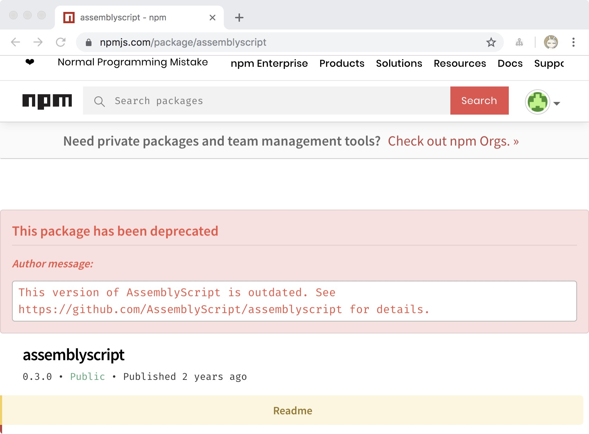
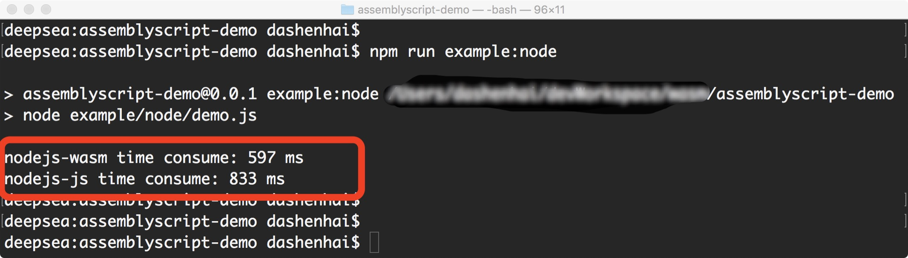
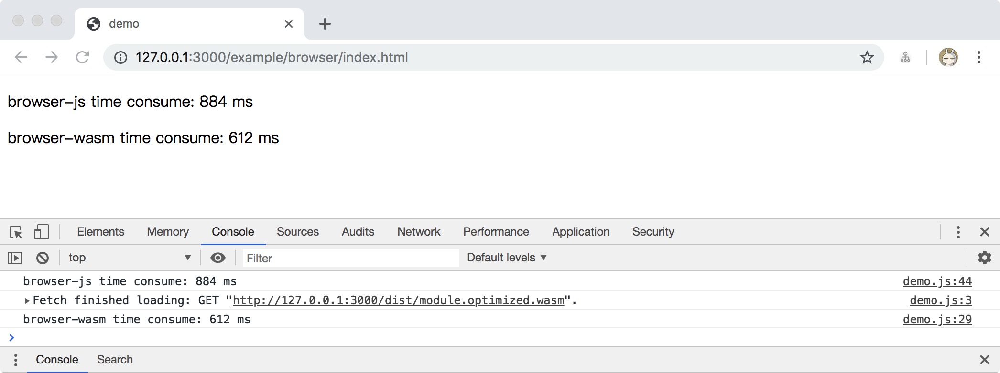

## 前言

前段时间开发图像处理工具[Pictool](https://github.com/chenshenhai/pictool)后，遇到高频的计算瓶颈。在寻找高频计算的前端能力解决方案过程中，入门学习了一下 WebAssembly 在前端中的应用。入门的过程中踩了不少坑，例如使用`AssemblyScript` 开发`wasm`时候，发现 `npm` 包 `assemblyscript` 已经不维护了，需要自己人工添加成从`Github` 仓库引用`assemblyscript` 的`npm`模块。

同时网上很多教程已经有点不同步，很多按照教程步骤后实现的代码跑不起来。最后参考原有网上的教程，一步步踩坑，实现了demo，同时也写下这篇文章作为笔记！

## WebAssembly

### 什么是 WebAssembly

- 计算机是不能直接识别运行高级语言(C/C++, Java, JavaScript等)。
- 计算机能读懂是0和1的电子元件信号，对应到运行的机器码。
- 在前端浏览器领域里，JS是解释执行，也就是运行到哪就解释成机器码让计算机读懂并执行，在高频计算性能上有一定的瓶颈。
- WebAssembly 字节码是接近计算机能识别的机器码，只要运行环境有对应的虚拟机，能快速加载运行。

### WebAssembly 优势

在前端主要的优势有

- 体积小
- 加载快
- 兼容强

### WebAssembly 前端能力现状

- Node.js 目前已经支持了 WebAssembly
- 大部分主流浏览器厂商也支持了 WebAssembly

### 什么是 AssemblyScript 

- `AssemblyScript` 是 `TypeScript` 的一个子集
- 可以用 `TypeScript` 语法编写功能编译成 `wasm`，对前端来说比较友好。


## 快速开始

### demo源码地址

如果想更快速尝试，可以直接去该 demo 仓库获取源码使用。

[https://github.com/chenshenhai/assemblyscript-demo](https://github.com/chenshenhai/assemblyscript-demo)

### 安装 AssemblyScript

由于 `AssemblyScript` 的 `npm` 官方模块已经停止维护，所以`AssemblyScript`的模块需要从`Github` 来源安装。




在`package.json`的依赖加入 `AssemblyScript` 模块的 `Github` 来源

./package.json

```js
{
  // ...
  "devDependencies": {
    "assemblyscript": "github:assemblyscript/assemblyscript"
    // ...
  }
}
```

再执行 `npm install` 从 `Github` 下载该模块到本地 `node_module`中

```sh
npm install
```

### 编写功能代码

编写一个 `斐波那契数列` 函数

在 demo 的目录 `./src/index.ts` 中

```js
export function fib(num: i32): i32 {
  if (num === 1 || num === 2) {
    return 1;
  } else {
    return fib(num - 1) + fib(num - 2)
  }
}
```

### 编译

在 `package.json` 编写编译脚本


./package.json

```js
{
  // ...
  "scripts": {
    "build": "npm run build:untouched && npm run build:optimized",
    "build:untouched": "./node_modules/assemblyscript/bin/asc src/index.ts -t dist/module.untouched.wat -b dist/module.untouched.wasm --validate --sourceMap --measure",
    "build:optimized": "./node_modules/assemblyscript/bin/asc src/index.ts -t dist/module.optimized.wat -b dist/module.optimized.wasm --validate --sourceMap --measure --optimize"
    
    // ...
  },
}
```

在项目根目录开始执行编译

```sh
npm run build
```

后面会在 `./dist/` 目录下产生编译后的几种 `wasm` 文件格式

```sh
├── dist
│   ├── module.optimized.wasm
│   ├── module.optimized.wasm.map
│   ├── module.optimized.wat
│   ├── module.untouched.wasm
│   ├── module.untouched.wasm.map
│   └── module.untouched.wat
```

### Node.js 使用

在 `./example/node/module.js` 文件中，封装`wasm`的`CommonJS`使用模块

```js
const fs = require('fs');
const path = require('path');

const wasmFile = fs.readFileSync(path.join(__dirname, '..', '..', './dist/module.optimized.wasm'))

const wasm = new WebAssembly.Module(wasmFile, {});

module.exports = new WebAssembly.Instance(wasm, {
  env: {
    memoryBase: 0,
    tableBase: 0,
    memory: new WebAssembly.Memory({
      initial: 256,
      maximum: 512,
    }),
    table: new WebAssembly.Table({
      initial: 0,
      maximum: 0,
      element: 'anyfunc',
    }),
    abort: console.log,
  },
}).exports;
```

Node.js 使用

```js
const mod = require('./module');

const result = mod.fib(40);
console.log(result);

```

执行 Node.js 的 `wasm` 引用

输出结果会是

```sh
102334155
```

### 浏览器使用

在 `./example/browser/` 目录下部署浏览器访问的服务


```js
├── dist
│   ├── module.optimized.wasm
│   └── module.untouched.wasm
├── example
│   ├── browser
│   │   ├── demo.js
│   │   ├── index.html
│   │   └── server.js
```

临时浏览器可访问的服务，这里用 `koa` 来搭建服务

具体实现在 `./example/browser/server.js` 文件中

```js
const Koa = require('koa')
const path = require('path')
const static = require('koa-static')

const app = new Koa()

const staticPath = './../../'

app.use(static(
  path.join( __dirname,  staticPath)
))

app.listen(3000, () => {
  console.log('[INFO]: server starting at port 3000');
  console.log('open: http://127.0.0.1:3000/example/browser/index.html')
})
```

浏览器使用 `wasm` 模块

具体实现在 `./example/browser/demo.js` 文件中实现

```js
const $body = document.querySelector('body');

fetch('/dist/module.optimized.wasm')
  .then(res => res.arrayBuffer())
  .then((wasm) => {
    return new WebAssembly.instantiate(wasm, {
      env: {
        memoryBase: 0,
        tableBase: 0,
        memory: new WebAssembly.Memory({
          initial: 256,
          maximum: 512,
        }),
        table: new WebAssembly.Table({
          initial: 0,
          maximum: 0,
          element: 'anyfunc',
        }),
        abort: console.log,
      },
    })
  }).then(mod => {
    const result = mod.instance.exports.fib(40);
    console.log(result)
  });
```

访问页面在 `./example/browser/index.html` 中

```html
<!DOCTYPE html>
<html>
<head>
  <meta charset="UTF-8">
  <title>demo</title>
</head>
<body>
</body>
<script src="demo.js"></script>
</html>
```

启动服务

```sh
node ./example/browser/server.js
```

浏览器访问页面


[http://127.0.0.1:3000/example/browser/index.html](http://127.0.0.1:3000/example/browser/index.html)

浏览器会出现结果


```sh
102334155
```


## 性能测试

### Node.js 对比测试


```js
const mod = require('./module');

const start = Date.now();
mod.fib(40)
// 打印 Node.js 环境下 wasm 计算 斐波那契数列 参数为40 的耗时结果
console.log(`nodejs-wasm time consume: ${Date.now() - start} ms`)

// 原生Node.js实现的 斐波那契数列 函数
function pureFib(num) {
  if (num === 1 || num === 2) {
    return 1;
  } else {
    return pureFib(num - 1) + pureFib(num - 2)
  }
}


const startPure = Date.now()
pureFib(40);
// 打印 Nodejs环境下 原生js 计算 斐波那契数列 参数为40 的耗时结果
console.log(`nodejs-js time consume: ${Date.now() - startPure} ms`)
```

#### 测试结果




- Node.js环境下，原生js 执行耗时 `833 ms`
- Node.js环境下，wasm 执行耗时 `597 ms`
- 对比下来，wasm 计算`斐波那契数列` 比 js 执行快了接近 `30%`

### 浏览器对比测试

```js
const $body = document.querySelector('body');

fetch('/dist/module.optimized.wasm')
  .then(res => res.arrayBuffer())
  .then((wasm) => {
    return new WebAssembly.instantiate(wasm, {
      env: {
        memoryBase: 0,
        tableBase: 0,
        memory: new WebAssembly.Memory({
          initial: 256,
          maximum: 512,
        }),
        table: new WebAssembly.Table({
          initial: 0,
          maximum: 0,
          element: 'anyfunc',
        }),
        abort: console.log,
      },
    })
  }).then(mod => {

    const start = Date.now();
    mod.instance.exports.fib(40);
    const logWasm = `browser-wasm time consume: ${Date.now() - start} ms`;
    $body.innerHTML =  $body.innerHTML + `<p>${logWasm}</p>`
    // 打印 浏览器环境下 wasm 计算 斐波那契数列 参数为40 的耗时结果
    console.log(logWasm)
  });


  // 打印 浏览器环境下 原生js 计算 斐波那契数列 参数为40 的耗时结果
  function pureFib(num) {
    if (num === 1 || num === 2) {
      return 1;
    } else {
      return pureFib(num - 1) + pureFib(num - 2)
    }
  }
  const startPure = Date.now()
  pureFib(40);
  const logPure = `browser-js time consume: ${Date.now() - startPure} ms`;
  $body.innerHTML =  $body.innerHTML + `<p>${logPure}</p>`
  console.log(logPure);
```


#### 测试结果




- Chrome浏览器环境下，原生js 执行耗时 `884 ms`
- Chrome浏览器环境下，wasm 执行耗时 `612 ms`
- 对比下来，wasm 计算`斐波那契数列` 比 js 执行快了也是接近 `30%`


从上述 Node.js 和 Chrome 环境下运行 `wasm` 和 原生`js` 的对比中，`wasm`的在高频计算的场景下，耗时的确是比原生`js`低，同时都是接近 `30%` 的计算性能提升。


## 参考资料

- [1] [IBM开发者文档: WebAssembly 现状与实战](https://www.ibm.com/developerworks/cn/web/wa-lo-webassembly-status-and-reality/index.html)
- [2] [奇舞周刊: 20分钟上手 webAssembly](https://juejin.im/post/5b7a3f3cf265da43606e9109)
- [3] [cunzaizhuyi: WebAssembly.LinkError()报错](https://cunzaizhuyi.github.io/WebAssembly-LinkError/)