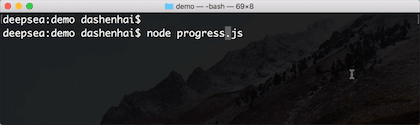
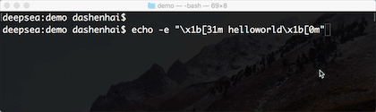
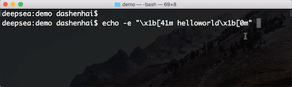
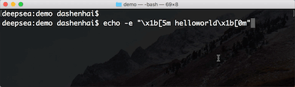
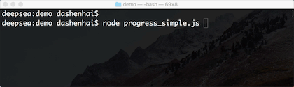
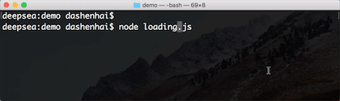

## 前言
经常用系统终端进行技术开发的过程会看到一些终端的动画效果，例如这个


最近刚好好奇的了解了一下，才知道实现这个能力是利用了终端支持的 `ANSI转义序列`，任何语言只要能调用终端的标准输入/输出(`stdin/stdout`)，都可以直接使用`ANSI转义序列`的规范制作对应的终端动画。

## 什么是ANSI

ANSI是一种字符代码，为使计算机支持更多语言，通常使用 `0x00~0x7f` 范围的1个字节来表示 1个英文字符。超出此范围的使用`0x80~0xFFFF`来编码，即扩展的ASCII编码 [1]

## 什么是ANSI转义序列

ANSI转义序列是一种带内信号的转义序列标准, 相关视频终端控制光标屏幕位置、文本显示、显示样式等操作。[2]

## 历史 [2]

### 规范历史

- 每个计算机显示终端制造商都有自己的转义序列规范
- 为了解决转义序列的不统一带来的问题，1976年通过的第一版ANSI标准——ECMA-48
- “ANSI转义序列”这个名词可以追溯到 1979年ANSI采用ANSI X3.64
- ANSI X3L2委员会与ECMA委员会TC1制定的标准合并为ISO 6429的国际标准
- 经历过多年改版，从1991年开始的第5版被ISO和IEC用作标准规范
- 1994年，ANSI取消了其标准，后续均以ISO标准为主

### 系统支持历史

- 微软的DOS 1.x不支持ANSI或任何其他转义序列
- DOS 2.0引入了添加设备驱动程序来支持ANSI转义序列的功能(基于ANSI.SYS标准)，由于性能问题，使用率还是很低
- Win32控制台不支持ANSI转义序列，只能借助其他软件辅助使用ANSI能力
- Window9x/Window XP/Window7/Window8 均不直接支持ANSI转义序列
- 2016年，Windows 10 开始在控制台应用程序中支持ANSI转义序列


## 基本使用
> 注意，需要在Linux/MacOS 的环境下学习和使用

### 输出带前景色的文本



```sh
echo -e "\x1b[31m helloworld\x1b[0m" 
```

- `\x1b[31m` 后面的文本字体色为红色，其中`31m`就是代表`ANSI`中的红色
- `\x1b[0m` 关闭所有属性


- 前景色范围在 `40 - 49`

|ANSI|后景色|
|----|----|
|40|黑色|
|41|红色|
|42|绿色|
|43|黄色|
|44|蓝色|
|45|紫色|
|46|深绿色|
|47|白色|


### 输出带后景色的文本


  

```sh
echo -e "\x1b[41m helloworld\x1b[0m" 
```
- `\x1b[41m` 后面的后景色为红色，其中`41m`就是代表`ANSI`中的红色
- `\x1b[0m` 关闭所有属性


- 文本颜色范围在 `40 - 49`

|ANSI|后景色|
|----|----|
|30|黑色|
|31|红色|
|32|绿色|
|33|黄色|
|34|蓝色|
|35|紫色|
|36|深绿色|
|37|白色|


### 输出闪烁的文本



```sh
echo -e "\x1b[5m helloworld\x1b[0m"
```
-  `\x1b[5m` 后面的文本闪烁
-  `\x1b[0m` 关闭所有属性
  

## 广泛支持的 ANSI 转义序列

|ANSI|功能|备注|
|----|----|----|
|\x1b[0m|重置|关闭所有属性|
|\x1b[1m |粗体或强度|-|
|\x1b[4m|下划线|-|
|\x1b[5m|闪烁|低于每分钟150次|
|\x1b[7m|反显|前景色与背景色交换|
|\x1b[8m |隐藏|-|
|\x1b[10m |默认字体|-|
|\x1b[11m |替代字体|范围(11-19)|
|\x1b[22m |正常颜色或强度|-|
|\x1b[23m |非斜体、非尖角体|-|
|\x1b[24m |关闭下划线|去掉单双下划线|
|\x1b[25m |关闭闪烁|-|
|\x1b[27m |关闭反显|-|
|\x1b[28m |关闭隐藏|-|
|\x1b[29m |关闭划除|-|
|\x1b[30m|前景色(黑色)|颜色范围(30-37: 黑-红-绿-黄-蓝-紫-深绿-白)|
|\x1b[38m|RGB前景色|参数为5;n或2;r;g;b|
|\x1b[39m|默认前景色||
|\x1b[40m|后景色(黑色)|颜色范围(40-47: 黑-红-绿-黄-蓝-紫-深绿-白)|
|\x1b[48m|RGB后景色|参数为5;n或2;r;g;b|
|\x1b[49m|默认后景色||
|\x1b[53m|上划线||
|\x1b[1A|光标上移1行|上移动n行，就是\x1b[nA|
|\x1b[1B|光标下移1行|下移动n行，就是\x1b[nB|
|\x1b[1C|光标右移1行|右移动n行，就是\x1b[nC|
|\x1b[1D|光标左移1行|左移动n行，就是\x1b[nD|
|\x1b[2J|清屏|-|
|\x1b[K|清除光标至行尾内容|-|
|\x1b[?25l |隐藏光标|-|
|\x1b[?25h|显示光标|-|
|\x1b[s|保存光标位置|-|
|\x1b[u|恢复光标位置|-|

## Node.js例子

### 例子一: 实现一个简单的控制台进度条

#### 实现效果



#### 实现源码

```js
const process = require("process");

const frame = "▊";

/**
 * 等待操作
 * @param {number} time 
 */
async function sleep(time = 10) {
  return new Promise((resolve) => {
    setTimeout(() => { resolve(); }, time)
  })
}

/**
 * 换行操作
 */
function printNewLine() {
  process.stdout.write(`\x1b[0C \x1b[K\r\n`);
}


class Progress {

  async run(time = 1000, percent = 100, modulo = 2) {
    const count = Math.floor(percent / modulo);
    for (let i = 0; i < count; i ++) {
      await sleep(time / count);
      this._print();
    }
    printNewLine();
  }

  _print() {
    // 控制打印进度条每帧的内容
    // 重复使用的时候打印开始会从上次结束的位置开始
    process.stdout.write(`\x1b[K${frame}`);
  }

}

const progress = new Progress();
progress.run(1000, 100);
```

### 例子二: 实现一个带背景和数字变化的进度条

#### 实现效果


#### 实现源码

```js
const process = require("process");

/**
 * 等待操作
 * @param {number} time 
 */
async function sleep(time = 10) {
  return new Promise((resolve) => {
    setTimeout(() => {
      resolve();
    }, time)
  })
}

/**
 * 换行操作
 */
function printNewLine() {
  process.stdout.write(`\x1b[0C \x1b[K\r\n`);
}

/**
 * 清行操作
 * @param {number} len 原有文本长度
 */
function clearLine(len)  {
  process.stdout.write(`\x1b[${len}D`);
}

const frame = "▓";
const backgroundFrame = "░";

class Progress {

  async run(time = 1000, percent = 100, modulo = 2) {
    const count = Math.floor(percent / modulo);

    for (let i = 0; i < count; i ++) {
      await sleep(time / count);
      const progressLength = this._printProcess(i, count, modulo);
      if (i < count - 1) {
        clearLine(progressLength);
      }
    }
    printNewLine();
  }

  /**
   * 打印进度条
   * @param {number} index 进度条当前帧索引位置
   * @param {number} count 进度条帧数
   * @param {number} modulo 进度条帧率变化模数
   */
  _printProcess(index, count, modulo) {
    let progressLength = 0;
    for (let i = 0; i < count; i ++) {
      if (i <= index) {
        progressLength += this._print(frame);
      } else {
        progressLength += this._print(backgroundFrame);
      }
    }

    let percentNum = (index + 1) * modulo;
    percentNum = Math.min(100, percentNum);
    percentNum = Math.max(0, percentNum);
    progressLength += this._print(` ${percentNum}%`);
    return progressLength;
  }

  /**
   * 打印终端文本
   * @param {string} text 文本
   * @param {number} leftMoveCols 光标左移动位数
   */
  _print(text, leftMoveCols) {
    let code = `\x1b[K${text}`;
    if (leftMoveCols >= 0) {
      code = `\x1b[${leftMoveCols}D\x1b[K${text}`;
    }
    process.stdout.write(code);
    return code.length;
  }

}

const progress = new Progress();
progress.run(1000, 100);
```


### 例子三: 实现一个等待Loading效果

#### 实现效果




#### 实现源码

```js
const process = require("process");


/**
 * 等待操作
 * @param {number} time 
 */
async function sleep(time = 10) {
  return new Promise((resolve) => {
    setTimeout(() => {
      resolve();
    }, time)
  })
}

/**
 * 换行操作
 */
function printNewLine() {
  process.stdout.write(`\x1b[0C \x1b[K\r\n`);
}


class Loading {

  constructor() {
    this._intervalId = -1;
    this._beforeLength = 0;
    this._isDuringLoading = false;
    this._loadingIndex = 0;
  }

  /**
   * Loading动画开始操作
   * @param {number} speed Loading每帧速度 
   */
  start(speed = 100) {
    if (this._isDuringLoading === true) {
      return;
    }
    this._intervalId = setInterval(() => {
      this._printLoadingText();
    }, speed);
    this._isDuringLoading = true;
  }

  /**
   * Loading 停止操作
   */
  stop() {
    clearInterval(this._intervalId);
    printNewLine();
    this._isDuringLoading = false;
    this._loadingIndex = 0;
  }

  /**
   * 打印 Loading 操作
   */
  _printLoadingText() {
    const max = 10;
    if (this._loadingIndex >= max) {
      this._loadingIndex = 0;
    }
    const charList = [];
    for (let i = 0; i < max; i++) {
      if (i === this._loadingIndex) {
        charList.push('==>');
      } else {
        charList.push(' ');
      }
    }
    
    const loadingText = [...['['], ...charList, ...[']']].join('');
    this._print(loadingText);
    this._loadingIndex += 1;
  }

  _print(text) {
    const code = `\x1b[${this._beforeLength}D \x1b[K ${text}`
    process.stdout.write(code);
    this._beforeLength = code.length;
  }
}

async function main() {
  const loading = new Loading();
  loading.start();
  await sleep(2000);
  loading.stop();
}

main();
```


## 参考资料
[1] 百度百科: ANSI
[2] 维基百科: ANSI转义序列

                 
              

                  

                  

              

               


