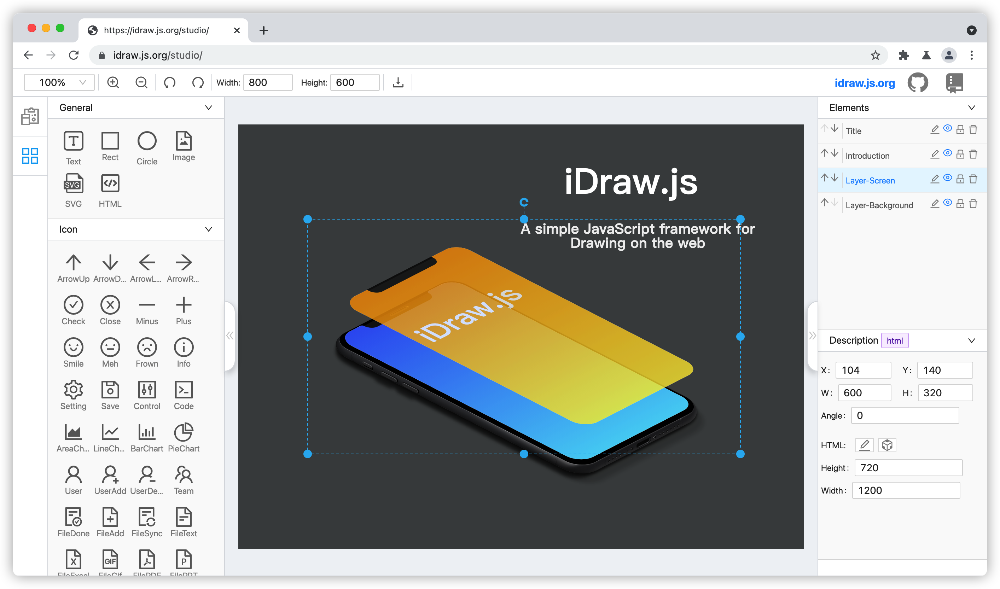

## 休息3个月，基于Canvas写了个简单的前端绘图JavaScript库

## 前言
不知不觉，有一年没发布公众号文章了，这几天刚好有时间，就抽空写了这篇文章。本文主要讲解我裸辞3个月以来，利用在家休息的空隙时间，开发了一个前端绘图的JavaScript库 iDraw.js。
## 为啥要开发这个东西

- 为了实现用纯Canvas能力结合图片、HTML和SVG作为素材 来做绘图工作。
- 为了试试看单独用 Canvas的2D（二维）API 能作出怎样的多种素材绘图工作。
- 最后是为了试试看尽量用 Canvas做素材的操控操作。
- 目前还没发现类似的可以操控素材绘图的Canvas开源框架，所以就想自己开发一个。
## iDraw.js简介

- 一个基于纯Canvas来实现绘图和操控素材能力的JavaScript库。
- 可以基于 iDraw.js 进行扩展自定义开发各种可视化操控应用，这里可以参考 idraw.js.org/studio/ 案例
## iDraw.js有哪些功能

- 支持绘制文字、矩形、圆形、图片、HTML片段和SVG片段 绘图元素
- 绘制文字

- 绘制矩形

- 绘制圆形

- 绘制图片

- 绘制HTML片段

- 绘制SVG片段

- 支持基于Canvas的可视化操作

## iDraw.js有哪些特点

- 可以绘制文字、矩形、圆形、图片、HTML片段和SVG文件，并且作为绘图元素。
- 可以直接在Canvas操控以上绘图元素，不用担心CSS和DOM变化的污染问题。
- Canvas操控绘制，并且是所见即所得可以直接导出绘制的图片结果。
- 由于可视化操控和图片生成都是基于Canvas，可以尽量减少绘图的浏览器兼容问题。

## 原理介绍

- 基于数据驱动来绘制Canvas的图画
- 基于 requestAnimationFrame 来控制数据变化时候，Canvas的重绘处理
- 内置一个前端并发队列来处理 图片、HTML和SVG的图片化转换渲染

## 实际使用案例

- 一个基于 iDraw.js 实现的UI可视化绘图
- @idraw/studio 的实现

## 其他

- GitHub地址: [github.com/idrawjs/](https://github.com/idrawjs/)
- 官方网站: [idraw.js.org/](https://idraw.js.org/)
- Playground API示例: [idraw.js.org/playground](https://idraw.js.org/playground/)
- 基于iDraw.js的Studio实际案例: [idraw.js.org/studio](https://idraw.js.org/studio/)
