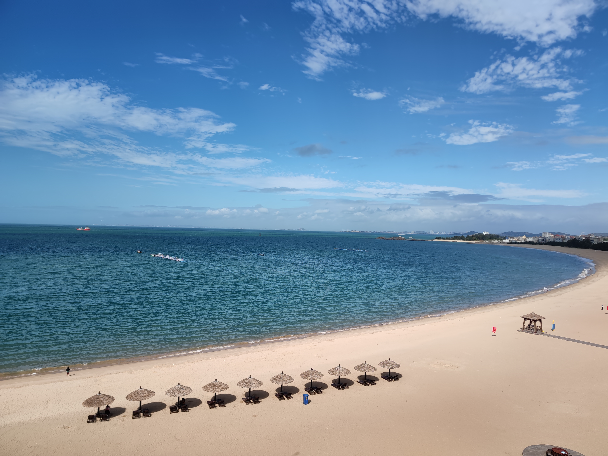
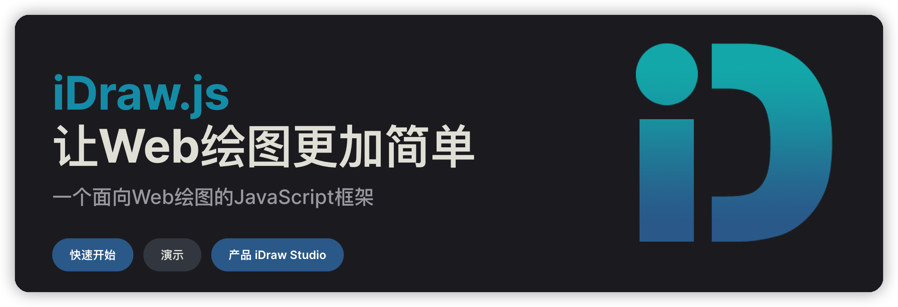
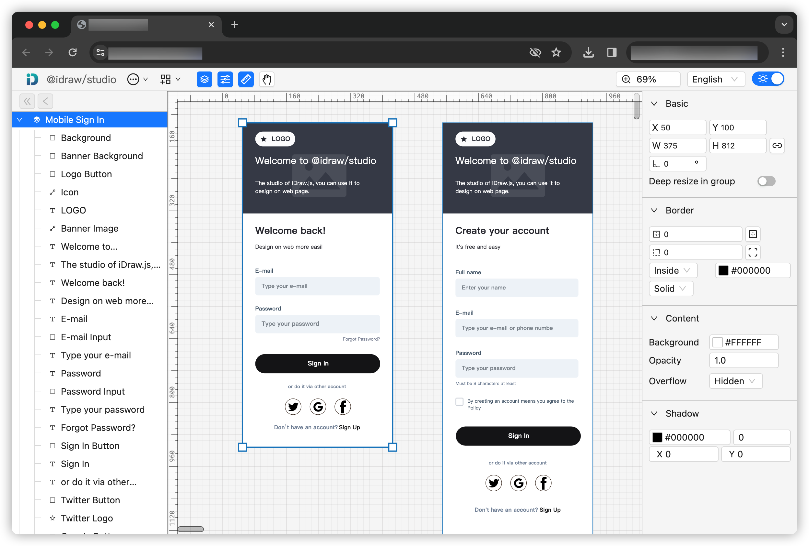
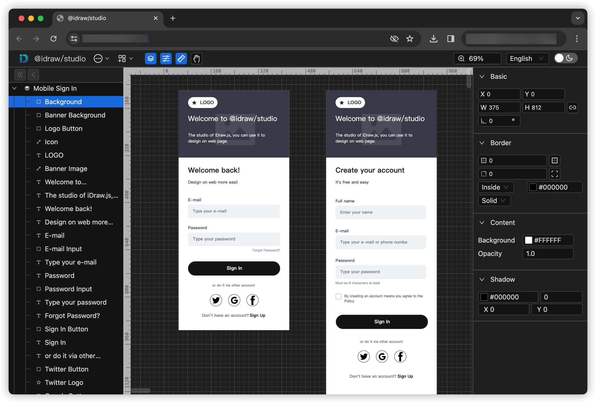
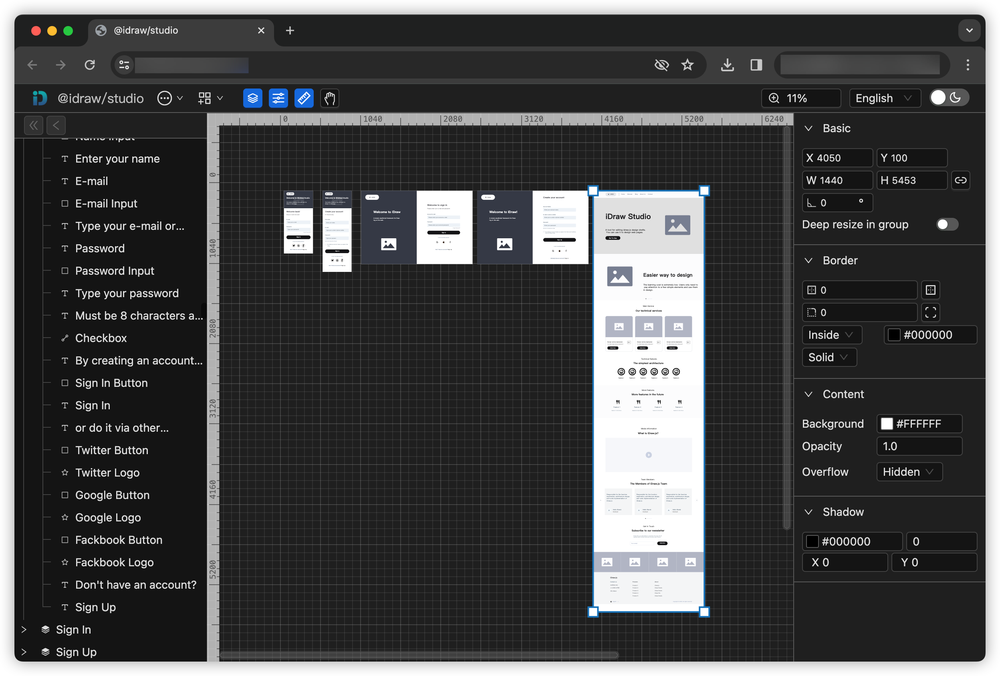

# `iDraw.js`的v0.4重构，大深海的2023年度总结

## 前言

2023年已经结束，是时候对过去一年做个总结。

话说熟悉我公众号的朋友们，应该有印象，就是我已经有两年没写任何文章了。在此，简单唠嗑一下这两年历程，两年前（2021年）裸辞休息，在写完 `iDraw.js` 第一版并开源后，我就回归职场了。在回归职场后，由于业余时间有限，加上对 `iDraw.js` 定位理解飘忽不定，经历过怀疑、弃坑、不舍和重构这四个过程，最终在2023年上半年开始了对  的重构。

## 重构`iDraw.js`是好玩的事情

在过去2023年里，利用业余零碎的时间，对`iDraw.js`重写、推翻、再重写，让 `iDraw.js` 的功能更上一个层次。至于回归职场后的工作内容，其实和普通程序员工作内容大同小异，乏善可陈，还不如自己业余时间沉淀的 `iDraw.js` 更好玩，更有成就感。

为啥`iDraw.js`对于我来说更好玩，这是因为`iDraw.js`是在我人生第一次裸辞长假中创作的开源产品，全凭技术兴趣驱动，没任何KPI压力，没掺杂任何职场气息。更重要是没有职场哪种“指指点点PUA”、“技术价值怀疑”和“方案选型撕逼”。

在开发和开源`iDraw.js`过程中，主打的就是“我开心，我就乐意这么写代码”。因此，我的2023总结，就是总结我开心的事情，有成就感的事情，也就是2023年的业余时间下，对`iDraw.js`进行v0.4版本的重构。

这是2023年五月份错峰出游，面朝大海写代码拍摄的海景，在假期里，在好玩的地方，面对好玩的景色，写好玩的代码，就是最好玩的事情。

也就是在这次出游后，加速了`iDraw.js`的重构步骤，到了年底，`iDraw.js`基本重构完毕，v0.4版本也初步完成，目前进入beta阶段。

## `iDraw.js` v0.4 来了，让Web绘图更简单

按照惯例，宣传产品需要带个口号，`iDraw.js`就不免俗，也来个口号，就是“让Web绘图更简单”，可能有些新朋友不知道`iDraw.js`是什么，那我也来简单介绍一下。

一个普通的Web绘图JavaScript框架，可以用于图片设计，Web网页设计等二维平面设计。

也只是一个正在并长期处于发展中的开源工具，从2021年5月提交第一次代码开始至今2年半里，持续迭代和优化。

## 为什么要重构`iDraw.js`

为什么要重构，主要是v0.3的设计缺陷，导致GitHub和邮箱收到以下几类
- 放大模糊，比如一像素内容放大后会出现模糊
- 画布受限，比如无法类似Figma进行无限画布操作
- 没有标尺，没有标尺可以知道元素的目测位置
- 缺少群组，导致所有元素平铺，管理元素不方便
- 没动画效果，支持绘制动画效果
- 元素匮乏，比如二维码元素、gif动图元素支持等
  

在此反馈的基础上，我也不是全量接受，毕竟开源只是“用爱发电”，况且时间精力有限，我还都是周末等业余空闲时间在维护。因此，我只挑选了符合`iDraw.js`定位“二维平面设计”的内容进行重构，也就是后续`iDraw.js`新增的内容。

## `iDraw.js` v0.4带来什么？

- 无限画布，数据层面上的“无限”，只要在JS的数值范围内，都可以作为尺寸数值。
- 矢量绘制，只要是非图片元素，绘制的内容都可以无损放大，也是`iDraw.js`前几个版本中，社区反馈的方法模糊问题，在v0.4版本中已经得到解决。
- 新增元素类型，新增了路径元素，作为兜底画图操作，基于SVG路径规范，可以绘制出任何形状和内容。
- 新增群组类型，更加方案绘图的元素组织操作。
- 功能中间件化，底层的功能采用中间件的思路，做到可以组装功能。比如，可以组装标尺、缩放和滚动条等功能。

以上就是`iDraw.js`的重构后特性功能，这些功能我将集成到 `@idraw/studio` 中，也就是`iDraw.js`的能力展示场所。

## @idraw/studio 向Figma学习

上述内容，提到一个点，就是`iDraw.js`从2021年第一次提交代码到2023年上半年，定位非常不清楚，全靠一腔热血“无脑”写代码。

这里就存在一个问题，缺少一个发展方向，容易会让兴趣和热情做无用功。因此，在开发`@idraw/studio`来集成演示`iDraw.js`功能时候，我就把Figma作为学习对象，尽可能地让`@idraw/studio`来复刻实现`Figma`的部分功能。

现在`@idraw/studio`已经能初步实现类似`Figma`的网页设计功能，虽然`@idraw/studio`目前处于很原始阶段，但在接下来一年会推动`iDraw.js`持续迭代优化，朝着Figma的特性来作为`iDraw.js`深度开发的方向。

## 踩过的坑

在开发和开源`iDraw.js`这两年多的过程并不是一帆风顺的。其中遇到各种磕磕碰碰，好在到了2023年底，轻舟已过万重山，现在也能总结一下踩坑的心得。

###  时间在精不在多

想清楚要实现的逻辑，每周末或节假日抽出2小时实现。每次写代码，就把精神集中控制在两小时内，休闲时间写多代码会产生疲劳感。

要时刻保持“兴趣驱动”来做技术开源，不要“为了做而做”，要为了“我高兴”和“有成就感”来做。

### 功能先跑起来，优化以后再说

“技术兴趣”驱动的开源项目，那么天然会自带很多“技术思维”，比如要尽量追求极致的技术性能。但如果过于注重性能优化，将会陷入牛角尖中浪费宝贵的时间和精力。

性能优化是个持续的工程，不是一蹴而就，持续的优化失败会带来连续的挫败感，会大大削弱技术动力。

### 不要怀疑，兴趣第一

在开源维护`iDraw.js`这两年里，被人吐槽是玩具，导致自我怀疑花费业余时间维护有意义吗？

发现有更完善的绘图框架，导致怀疑自己重新造轮子有意义吗？

在投入大量业余时间维护时候，怀疑是一个很大的阻力，消除阻力的方式就是强调“兴趣”的重要性，因为是兴趣驱动，自己开心就好，别管哪些和兴趣无关的因素。

## 未来计划

目前`iDraw.js`还处于v0.4的beta阶段，还有很多待优化的地方，打算在2024年花一年的业余时间，打磨出稳定的 v0.4 版本。

## 其它

- iDraw.js官网 https://idrawjs.github.io/
- iDraw.js仓库 https://github.com/idrawjs/idraw
- @idraw/studio仓库 https://github.com/idrawjs/studio
- @idraw/studio演示 https://idrawjs.github.io/studio/

